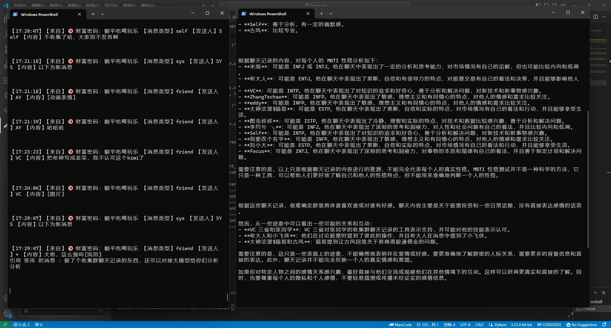

## 我有啥用
### 1.自动记录微信群或者跟某个人的聊天记录，每隔一小时保存到msgdata/日期 目录下
### 2.调用豆包大模型，分析这些聊天内容

## 目前有几类分析场景：
### 1.总结群里提出的问题以及讨论出的相应的解决方案
### 2.可以通过黑色幽默和毒舌标签的形式分析每个人的性格
### 3.分析每个人的mbti性格
### 4.分析ta爱不爱我，我后续如何出击
### 5.分析聊天对象的真实关系

## 如何下载
### git clone URL_ADDRESS

## 安装依赖
### pip install wxauto
### pip install 'volcengine-python-sdk[ark]'
### pip install volcengine

## 如何使用
### 设置chatroom_list.txt文件，把聊天窗口的名字写在里面，一行一个
### 打开微信pc端，然后打开群聊或者单聊窗口
### 执行python mywxhelper.py即可开始记录聊天记录
### 收集一天聊天内容，然后执行python llmgo.py即可开始分析聊天记录
### 记得要先修改llmgo里面豆包的apikey和model

## 联系我：
### vagerent@126.com

